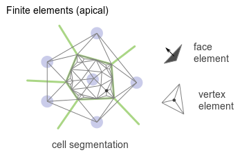

title: Un tour des différentes méthodes de modélisation
slug: comparaison_modeles
date: 08-16-2015
tags: modeling, epithelium, tyssue, fr
summary: Ce post a pour objectif de discuter les différentes stratégies de modélisation d'un tissu biologique.

Ce texte est un travail en cours. N'hésitez pas à commenter ci-dessous pour m'aider à l'améliorer.
J'essaierai peu à peu de sortir du style télégraphique.

## Comparaison des différentes classes de modèles de tissus

Basé principalement sur la revue de
[L.A. Davidson et al. / Journal of Biomechanics 43 (2010) 63–70](http://dx.doi.org/10.1016/j.jbiomech.2009.09.010)

L.A Davidson et ses collègues distinguent trois grandes classes de modèles:

1. Modèle de Potts cellulaire
2. Modèles de type _vertex_
3. Modèle en éléments finis

### Modèles de type _vertex_

C'est le modèle utilisé actuellement pour les simulations de formation du pli.

Aspects positifs:

* Facile à saisir et à implémenter (peu de paramètres)
* Relation très directe image $\leftrightarrow$ simulation
* Adapté pour l'organisation appicale de cellules épithéliales jointives
* Adapté à des topologies dynamiques

Aspects négatifs:

* Limité à des cellules jointives: pas de délamination, par exemple.
* Tout se passe au niveau des jonctions.
* Peu adapté à la prise en compte des événements baso-latéraux.
* Difficile d'inclure des interactions hors du maillage.
* Physique peu détaillée.

### Modèle de Potts cellulaire

Dans cette classe de modèles, l'espace est divisé en cubes de taille
petite devant la taille des cellules. Chaque cube est assigné à une
cellule, et on minimise une énergie sur les faces des cubes, en
fonction de leur voisinage (intra-cellulaire / interface). On peut
l'envisager comme un système multi-agents.

Aspects positifs:

* De nombreuses implémentations existent déjà, facile à mettre en œuvre
* Adapté à la modélisation de la migration cellulaire dans des approches
  en termes de populations de cellules.
* Grande souplesse dans la modélisation des intéractions

Aspects négatifs:

* Mal adapté à des géométries complexes
* Mal adapté à la modélisation des interfaces
* "Loin" des détails bio-physiques des intéractions cellule-cellule
* Grande souplesse dans la modélisation des intéractions

### Méthodes par éléments finis

C'est la discrétisation d'un système d'équations continues dans l'espace.
Dans le cas de la modélisation d'une **couche**, apicale par exemple,
la discrétisation est effectuée en découpant le tissu en faces triangulaires.

Le maillage est **plus fin** que dans le modèle vertex. Contrairement
au modèle de Potts, il est **adaptable**, de manière à décrire plus
finement le milieu au voisinage des points de forte variations, par
example aux interfaces cellule - cellule.

Aspects positifs:

* Adapté aux problèmes continus
* Fidélité à la géométrie
* Proximité avec la réalité biophysique du tissu

Aspects négatifs:

* Gourmant en temps de calcul (et en temps d'optimisation)
* La segementation n'est pas triviale (maillage régulier ou adaptatif, etc.)

Reste à aborder:

- Détailler la physique des méthodes en milieu continu
- Inclure des exemples pour chaque méthode
- Rédiger une introduction
