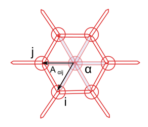

title: From leg-joint to tyssue, a refactoring story - Ep. 1
slug: gathering_thoughts
date: 08-17-2015
tags: drosophila, modeling, python, scipy
summary: I'm giving a talk at Euroscipy '15 in two weeks \o/ \o/... This post is a place to gather thoughts on the `leg-joint` and `tyssue` libraries, of which I'll be talking.


### Intro

So I'm giving a [talk](https://www.euroscipy.org/2015/schedule/presentation/24/)
at [EuroScipy](https://EuroScipy.org/2015) at the end of the summer (hooray!).
It is based  on the code I developed to model fold formation in the
drosophila leg imaginal disk, which was published earlier this year. A lot as
moved since I submitted the abstract. So here are some thoughts on what
happened, and what motivated the switch to a new, more generic library.


Here is the submitted abstract (I'm all about code re-use)

>Biological tissues, and more particularly
[epithelia](http://en.wikipedia.org/wiki/epithelium) are very
particular kinds of material. Not only do they behave like solids
_and_ liquids at the same time (think shaving foam), they are also
governed by the behavior of their constituent individual
cells. Biological processes (a bunch of incredibly complex chemical
reactions) and physics are intertwined so that complex forms emerge
from initially smooth tissues.

>Along advanced imaging techniques and genetic manipulation of model
organism, biophysical modeling is key in understanding these shape
changes, or morphogenesis. We studied the role of programmed cell
death, or [apoptosis](http://en.wikipedia.org/wiki/apoptosis) in the
formation of a fold in the fruit fly pupae (an intermediate stage
between larva and adult). In
[a recently published article](http://dx.doi.org/10.1038/nature14152)
we demonstrated that apoptotic cells had an active role in shaping
this fold (which will later become a joint in the adult fly's
leg). Cells die on a ring around the socket shaped tissue (one cell
thick, and about 200 µm in diameter), they contract and pull on their
neighbors, initiating changes in the tissue properties.

>In this presentation, I will describe how we use python to develop a
numerical model of this epithelium. The
[leg-joint](https://github.com/glyg/leg-joint) module is based on
Tiago Peixoto's [graph-tool](http://graph-tool.skewed.de) library, and
uses SciPy optimization routines to perform the gradient descent at
the core of the dynamical simulation. The following topics will be discussed:

>* _Visualization_: plain matplotlib vs [vispy](http://vispy.org) vs
  [Blender](http://www.blender.org).

>* _Performance_: can we go from 24 hrs per simulation to less than 1?
  The pure python vectorization and BoostPython/CGAL routes.

>* _Future plans_: towards a biological tissue physics engine.

>The code is showcased in a series of Jupyter Notebooks that can be
browsed
[here](http://nbviewer.ipython.org/github/glyg/leg-joint/tree/master/notebooks/).


The three points above deserve some developments, so I'll do 3 posts, not in the original order, though.

1. Performance - this post
2. Future plans - not so future anymore - [next post](gathering_thoughts_2.html)
3. Visualization (where I'm least advanced) - the third one


### The pitfalls of research driven developments

The `leg_joint` code was developed while our understanding of the biology was
progressing at a fast pace, as Magali's team accessed new genetic tools and
gradually improved the fluorescence microscopy images of the drosophila's leg
disk. That left little room for API design, or optimization. I went for results
straight ahead, tried to document and test, though not enough, but my time was
well spent in maths (that bloody gradient), biology and getting correct figures.

For the published version, getting a simulation of the full fold formation
process takes about 24 hours on a single core, which is not sustainable ...

### Optimization

So I started refactoring once the paper was published. The performance
bottleneck was quite obvious: the gradient descent code was called locally (only
on a group of cells) a lot of times to mimic a global epithelium relaxation, and
this code contained explicit loops over each cell of the global patch to update
geometry and gradients **at each optimization step**. This is bad, but was easy
to write. It also made whole tissue optimization depressingly slow. As a good
SciPythonista (if that's a thing), I started looking at vectorization strategies.

I started using graph-tool for its efficient management of dynamic graphs and
graph drawing capacities. In this library, values attached to vertices and edges
can be accessed as Numpy arrays through the `get_array` attribute of the
[`PropetyMap`](http://graph-tool.skewed.de/static/doc/graph_tool.html#graph_tool.PropertyMap)
class. But as the documentation warns:

> The returned array does not own the data, which belongs to the property map. Therefore, if the graph changes, the array may become invalid and any operation on it will fail with a `ValueError` exception. Do not store the array if the graph is to be modified; store a copy instead.

Furthermore, you can only set the 'true' values of the property map for the all
array at once. Said otherwise, you can't use fancy indexing to set values of a
given variable (e.g. the `x` coordinate) of a subset of the graph's vertices
directly, you have to modify a copy of the array and feed it back to the
`PropertyMap`.

You can access a subset of the graph through _filtering_, i.e.
defining a binary mask over the network. But filtering is not the same as
indexing, for example you can do this with indexing:

```python
import numpy as np
a = np.arange(4) + 2
b = a[0, 1, 3, 3, 3]
print(b)
>>> [2, 3, 5, 5, 5]
```

But you can't tell a mask to repeat a value, and that was exactly what I needed
to compute my epithelium geometrical properties. With PropertyMaps, you can
*get* values from fancy indexing, but *setting* them back is more complicated,
due to the rather convoluted way graph-tool mirrors the underlying C++ data and
the property map `.a` attribute, that returns a numpy array. Of course
graph-tool was not meant for that kind of computation, it's focus is on graphs'
topology, not geometry or calculus.

The cell's area is a good example for the type of computation I was trying to
run. It is computed as the sums of the cell's sub-faces areas, which are
themselves half the norm of cross product of two sub-face vectors:



The area of the sub-face is $A_{\alpha ij} = || r_{\alpha i} \times r_{\alpha j} || / 2$.

Cross product works just fine with numpy 2D arrays, but to compute it, I need to
repeat each vector twice for each adjacent face, sum over the cells, and put
this back in the property map holding the cell area, for future use. Hence my
indexing issue with graph-tool property maps. This motivated the passage to
`pandas` DataFrames to do the geometrical computing. Fancy indexing is what
pandas is made for, isn't it?

Here is an outline of the strategy I used to gather the data from the graph's property maps and turn them into `DataFrames`:

1. First find all the triangular faces in the graph, using graph-tool's
  `subgraph_isomorphism`, and get the indices of the 3 vertices (two junctions
  and a cell).

2. Use this as a `MultiIndex` to instanciate a `DataFrame` holding a copy of the
  relevant data.

3. Do the maths.

4. Feed back the data to the graphs' property maps.

Thanks to graph-tool, the first point is easy to achieve, and quite fast (like
some seconds for a full 2000 cells simulation):


```python
def get_faces(graph, as_array=True):
    '''
    Retrieves all the triangular subgraphs of the form
       1 -- > 2
        ^   ^
         \ /
          0
    In our context, vertex 0 always corresponds to a cell
    and vertices 1 and 2 to junction vertices

    Parameters
    ----------
    graph : a :class:`GraphTool` graph instance
    as_array: bool, optional, default `True`
      if `True`, the output of `subraph_isomorphism` is converted
      to a (N, 3) ndarray.

    Returns
    -------
    triangles:  list of gt.PropertyMaps or (N, 3) ndarray
      each line corresponds to a triplet (cell, jv0, jv1)
      where cell, jv0 and jv1 are indices of the input graph.
    '''
    tri_graph = gt.Graph()
    ## the vertices
    verts = tri_graph.add_vertex(3)
    ## edges
    tri_graph.add_edge_list([(0, 1), (0, 2), (1, 2)])
    _triangles = gt.subgraph_isomorphism(tri_graph, graph)
    if not as_array:
        return tri_graph, _triangles
    triangles = np.array([tri.a for tri in _triangles], dtype=np.int)
    return triangles
```


This works thanks to the definition of the graph edges, with edges from cell
center to junction vertices always oriented outwards, such that the triangular
pattern uniquely defines the set of faces.

The `triangles` array then served as a `MultiIndex` for a pandas `DataFrame`
called `faces`. Each of the vertex index was repeated as many times as
necessary, and it was then easy to pick the correct data to compute the desired
crossproduct, and do sums for each cells (something like
`faces['sub_areas'].sum(level='cell')`).

According to `git log`, it took me about three weeks to vectorize completely the
geometry and gradient computation, but the effort was worth it, with a time gain
about two orders of magnitudes (unfortunately, I didn't document properly the
successive gains in computing time), close to the 24 to 1 hours goal I bragged
about in the abstract, at least on a relatively simple test case. At that point,
"all" that was left was the fourth point of the list above.

### Refactoring

But then... I spent the next two months (!) trying to integrate back my new
`faces` DataFrame within the general framework. The main hurdle comes when the
graph topology changes, which creates indexes mis-alignments and synchronization
nightmares. Maybe it's my fault for not doing this at the proper level, or not
specifying things more clearly; alternatively, graph-tool is not that adapted to
3D geometry computations and it's time for some new API design.

So at the beginning of May, I decided to reboot the project, and started working
on [tyssue](https://github.com/CellModels/tyssue). As this post is already too
long,  I'll discuss this on the next one.
