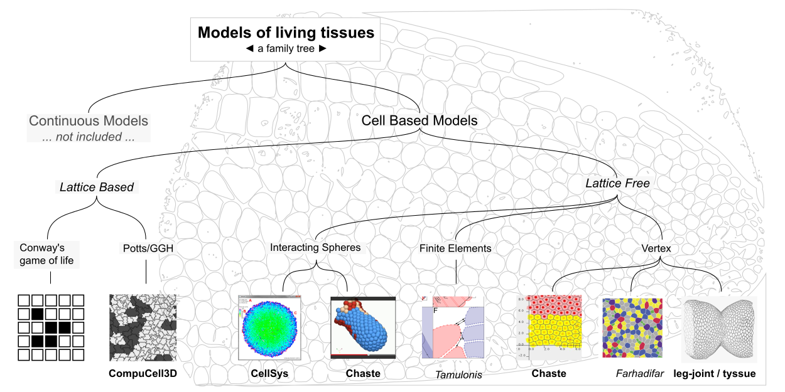
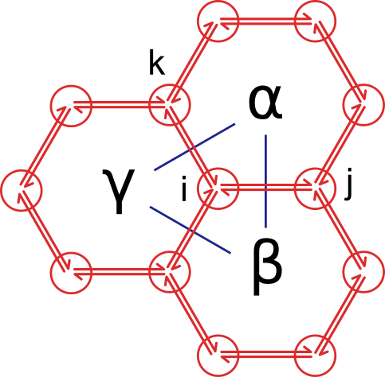

title: From leg-joint to tyssue, a refactoring story - Ep. 2
slug: gathering_thoughts_2
date: 08-21-2015
tags: drosophila, modeling, python, scipy
summary: I'm giving a talk at Euroscipy '15 in two weeks \o/ \o/... This post is a place to gather thoughts on the `leg-joint` and `tyssue` libraries, of which I'll be talking - episode 2 of 3.

That's the second blog post of three reflecting on the modeling.

1. [Performance](gathering_thoughts.html) - read this first !
2. Future plans - the future is already here
3. Visualization - even more future !

#### Previously

I started optimizing, then refactoring the `leg-joint` code to gain performance.
As I was doing this, I realized it would be cleverer to go all the way back to
the drawing board (actually a paper notebook), as maybe some parts of the
simulation could be re-used with different geometries. After all, many epithelia
share common traits with the leg imaginal disk. At the same time, Magali and I
started talking with two physicists, [François
Molino](http://www.coulomb.univ-montp2.fr/user/francois.molino) and  [Cyprien
Gay](http://www.msc.univ-paris-diderot.fr/~cgay/homepage/doku.php?id=Accueil),
who are applying bleeding edge soft-matter physics to biological tissues. It
turns out Cyprien and his colleges recently published a [milestone
paper](http://dx.doi.org/10.1140/epje/i2015-15033-4) on continuous models; both
were keen on trying cell based models, and the leg disk is of course very rich
on this regard. So while I'm generalizing geometry, why not physics?

#### The road ahead

So how do we get there?

1. Classify existing biophysical tissue models.

2. Specify the subset of said models we want to address.

3. Try to craft an API.

4. Choose the proper libraries.

5. Code simple test cases (simple geometry, simple physics).

6. Repeat from 3 until the API and tech are +/- stable...

7. Implement a real world problem, same physics as in 5.

8. Try new physics at constant geometry.

The route through those points will start a bit far from code.

### A very brief tour of the biophysical models of living tissues

As they imply dramatic changes in a tissue shape and organization, morphogenetic
events have long been the focus of mechanical modeling efforts. As early as
1917, D'Arcy Thomson exposed the underlying mathematical and physical
relationships underpinning cells and multi-cellular organism shapes and
dynamical behaviors (in the seminal work [On Growth and
Form](https://archive.org/details/ongrowthform00thom)). In recent years,
technical progresses have provided very detailed geometrical, dynamical and
biochemical data on morphogenetic processes, allowing for ever finer
mathematical modeling and computer simulations. Meanwhile, many models and
simulations have been developed. The interested reader will find a very clear,
useful and complete discussion of the topic in [C.V.T Tamulonis PhD
dissertation](http://dare.uva.nl/record/1/394902). Seriously, I can't stress
enough how this work is nice and complete!

For now, I just drafted a tree of the different models, as a basis for the
discussion:

The underlying dragonfly wing is from Figure 162 of _On Growth and Form_ (p.476
of the above linked edition). On the tree tips are examples (not even close to
exhaustive) of implementation for each models. Bold names refer to softwares,
slanted to a researcher and it's publications.

**Continuous models** deal with phenomena that span multiple cells in size, such
that the changes in shape can be smoothed out, the detailed cell-cell
interactions are not necessary to understand the tissue's shape. Star among this
huge family are organ simulations, among which the heart. To grasp the state of
the art on the matter, [you should rush to see the
video](http://www.scls.riken.jp/en/research/03_integration/) of a heart
simulation by Shu Takagi's group at Riken. Cell agregates, such as
multi-cellular tumor spheroids, are studied and modeled as continuous tissues.
The paper cited above ([Sham Tilli et al,
2015](http://dx.doi.org/10.1140/epje/i2015-15033-4)) precisely sets down a
formalism that includes cell biology specific components (i.e. cell population
dynamics and re-arangements, more on that later) in a continuous dynamical
(rheological, more precisely) framework. See [Cyprien's
site](http://www.msc.univ-paris-diderot.fr/~cgay/homepage/doku.php?id=publications:2014granularcontractile)
for more details on that. Finally, I must mention the incredible [OpenWorm
project](http://www.artificialbrains.com/openworm), which tackles the
neurobiology of C. elegans and integrates it to a mechanical (particle based) framework.

For now let's concentrate on **Cell Based models**, in which `leg-joint` fits.

By definition cell based models are described by a multi-agent design pattern.
This is where biological tissues radically differ from any other material: cells
can **act by themselves** and **exchange information** between each others, an
individual's **behavior** influences the overall shape of the tissue. We'll see consequences of this for the API design. For now, let's go further down the tree.

The next branching is between lattice based and lattice free models.

_Lattice based_ were developed first, inheriting directly from early cybernetics
research (Norman Wiener, John Von Neumann) on [cellular
automata](https://en.wikipedia.org/wiki/Cellular_automaton). Conway's game of
life was described in 1970, and you can find a nice python implementation by
Jake VanderPlas himself
[here](https://jakevdp.github.io/blog/2013/08/07/conways-game-of-life/). It's
not a biological tissue model, really, but it captures the essence of lattice
based modeling: cells are pixels or collections of such on a fixed grid. The
evolution of the system is solved by looking at interactions between each pixel
and it's neighbors. That's what goes on in a more detailed manner in cellular
Potts models and their descendant the Glazier-Graner-Hogweg (GGH) model. These
models are well established, and [CompuCell3D](http://compucell3d.org) provides
a very handy, optimized and scriptable software for defining and running GGH
simulation in 2D and 3D geometries. Lattice based models are well suited to
study phenomena such as collective migration (e.g. tumor invasion) or cell
population dynamics. As partial differential equations can be solved across the
grid, they can also deal with reaction-diffusion mechanisms, and thus signaling.
That's all nice and well, but the grid is also a constrain (if precise shapes
are of interest), and the physics governing pixel state transition is very
phenomenological, it does not really capture the _mechanical_ aspects of the
tissue.

In _lattice free models_, the system's space (usually 2 or 3 dimensional)  is
continuous and the objects are described by their metric in that space. An early
split is between models made of _descrete spherical elements_  and the ones
relying on a _vector based_ description. In the former class, cells are
described as spheres (like in [Chaste](http://www.cs.ox.ac.uk/chaste/)) or
smaller particle clouds, as in the work by [P.E van Liedekerke et
al.](http://dx.doi.org/10.1103/PhysRevE.81.061906) cited by Tamulonis.

The later branch divides into finite elements models (see [CVT Tamulonis
](http://dare.uva.nl/record/1/394902) again) and vertex models, where
`leg-joint` and `tyssue` fit (ouf! as we say in French). Thanks to the close correspondence between those model architecture and the cell boundaries, they are well adapted to the description of contiguous, one cell thick tissues as the epithelium we're interested in.

Now that we know where we are in the grand scheme of things, let's dig on the
library's structure. We're at step 3 already!

### Library architecture and API design.

#### Prolégomène: libraries vs standalone software.

Software can come in various forms. Traditionally, and as is the case for most
of the works presented above, simulations would be developed in a compiled
language such as C++ (the uncontested giant in the field) and distributed as
standalone executables. I'm a python user, and prefer to use libraries, and
develop by `import`ing what I need when I need it. I feel that doing development
in the Jupyter notebook gives me a lot of freedom to explore and hack. The
user/developer frontier is blurry in the scipy community for a good reason:
that's a very efficient way of developping software. So, contrary to e.g.
**Chaste**, `tyssue` is designed as a modular, hackable library.

#### Object architecture and design patterns

##### Objects to consider

To fix the ideas, let's work on a minimal 2D example of what we try to model.
Generalizing to more complex geometries is deferred to further headaches :-p.

Here is our 2D three cells epithelium:

The epithelium contains **cells** indexed by Greek letters, **junction
vertices**, indexed by Latin letters, and  **junction edges**. The blue links
denote a **neighborhoud** relation between two cells. In 2D, the edges can be
described as pairs of _Halfedges_ ([see the documentation on Halfedge Data
Structures in CGAL](http://doc.cgal.org/latest/HalfedgeDS/index.html)). In 3D,
this concept is generalized by the [_Linear cell complex_
](http://doc.cgal.org/latest/Linear_cell_complex/index.html#Chapter_Linear_Cell_Complex)
structure, made of connected _Darts_. Both Halfedges and Darts hold information
on their source, target and the cell they are associated to. So the pair of
Halfedges between vertices $i$ and $j$ should be indexed as $i j, \alpha$ and $j
i, \beta$. In 3D, there will be a fourth index for a given Dart, giving the
associated face of the cell, see the discussion on Darts orbit and $\beta_i$
operators on CGAL's doc.

The ensemble of those objects and their relations is called the **topology** of
the system. Perhaps abusively, said topology _also includes the set of
geometrical points associated with the vertices_ (but nothing more, see below).

#### Data Structures

To the topology is associated data: geometric characteristics, parameter values
and so on. We want to be able to get and set these data by single elements  or
through fancy indexing. Ideally, without copying it, and in a transparent way to
the python user. But the above mentioned concepts are well defined and optimized
in CGAL, and it would be a waste not to rely on all this good work. Yet, most of
this data is irrelevant to CGAL: we could for example associate a color to a
cell for representation purpose, that needs to be dynamically allocated, etc.,
all that in an interactive python session. graph-tool does a very good job at
managing that with `PropertyMaps`, but we  [saw](gathering_thoughts.html) it was
not fitting exactly our needs. Wrapping C++ and Numpy arrays is [not
trivial](https://github.com/CellModels/tyssue/issues/5).

So here is how I see this: let the C++ side of things completely ignore the data --
to the exception of the positions of the vertices in space, which CGAL need, and
will receive special treatment --, and just let it manage topology. This way the
only
[`CellAttribute`](http://doc.cgal.org/latest/Combinatorial_map/classCellAttribute.html)
associated with a CGAL object is its index (plus the `Point` for vertices).

The CGAL/python interface is then just a matter of passing the indices (as
`std::vectors<int>`) in read only mode to python, and updating the points back and forth. Python side, the core data structure is then comprised of 3 DataFrames (4 in
3D actually):

1. `cell_df`, indexed by the `Index` `cell_idx`

2. `jv_df`, indexed by the `Index` `jv_idx`

3. `je_df`, indexed by the `MultiIndex` `je_idx`, itself comprised of a `(srce,
trgt, cell)` triple (e.g. ${i, j, \alpha}$). In 3D, it
would be a quadruple `(srce, trgt, face, cell)`.

Here is a sketch summarizing the above, along with the behavior and
visualization aspects I'll discuss next.

You can find a toy implementation (CGAL independent) in [this
notebook](
http://nbviewer.ipython.org/github/CellModels/tyssue/blob/master/notebooks/core_architecture/Simulation%20structures%20and%20specification.ipynb#Python-implementation-of-the-class-structure),
along with examples of simple computation combining data from cells and
junctions.

##### A note on time

I haven't spoken of the time dimension yet. The above description gives a static
view of the tissue. Of course, the whole goal is to look at evolutions. Time
will be a global attribute of the system. For all the DataFrames, we can
construct a Panel where the fourth dimension is the time component, stacking up
static views of the tissue (this can also be achieved via a supplementary 't'
index for each dataframe). Whether this is feasible, or it's better to record
the data at each time step is to be determined. For small systems, the former
will be easier, but might not scale, and some kind of buffering might be needed
(to be continued, data management is not my strong suit).

##### External constrains and supra cellular components

Further down the road, it might be necessary to include other elements, for
example the extra-cellular matrix, which by definition is not included in this
framework. If its shape is simple and static enough, this could be described in
terms of a force _field_ in the space surrounding the tissue. One could also
envision a mixed continuous - cell based model, where the ECM is described as a
finite elements triangulated volume. It is not clear to me how to manage contact
points here, I'm sure that will be fun. Apart from the ECM, one can think of
trans-cellular actin cables or an egg shell constraining the epithelium.

On that matter, management of contact points and mesh collision is not trivial,
but it looks like the great folk at CGAL [have this sorted out for
us](http://stackoverflow.com/questions/22900932/cgal-meshes-intersection-collision).

##### Physics

The architecture described above describes the state space of the epithelium,
and it's associated parameters. We can then add physical data: forces or
gradients, for example. If the specific columns to consider depend on the
physics engine, the resolution of the dynamical equations (wether through
gradient descent, ODEs, etc.) should be independent of the topology at one point during the simulation.

##### Agent-like behavior

As I said earlier, cells are not passive chunks of material, but **individuals**
displaying different behaviors, either individually or collectively. In this
sense, cells are agents. This must be reflected in the library architecture as
to make it easy to translate in the simulation the biologist's insight of the
modeled biological scenario. Here are some examples:

* Cell growth
* Cell division
* Cell intercalation (aka Type 1 transition)

* Apoptosis

For each of those behaviors, one cell or a group of cells will be implicated
(the `actors`), and some specification on the physics involved that might look
like a list of `actuators` (I'm thinking for example at the actin apico-basal
cable in the fold formation scenario) specifying the interactions and their
application points. Every behavior can trigger a change in topology, requiring a
re-indexing from CGAL, and sets the system off-equilibrium, which is resolved by
the physics engine. Those concept are still in early development, and the API is
still sketchy here.

##### Events, signals and asynchronicity

Associated with the multi-agent pattern comes the idea that those agents, the
cells, could act asynchronously, each behavior sending signals to neighboring
cells and the hole epithelium. At each time step, we can imagine to gather all
the ongoing behaviors (cell 123 might divide, while cells 234, 235, 236, and 244
undergo a type 1 transition) and solve the physics system only once for the
whole tissue. Once again, this is still a bit sketchy, and any comments are
welcome.

### Next step: data viz!

This vast subject (3D! 3D+time!, `vispy`!, `webGL`!) will wait next post.
