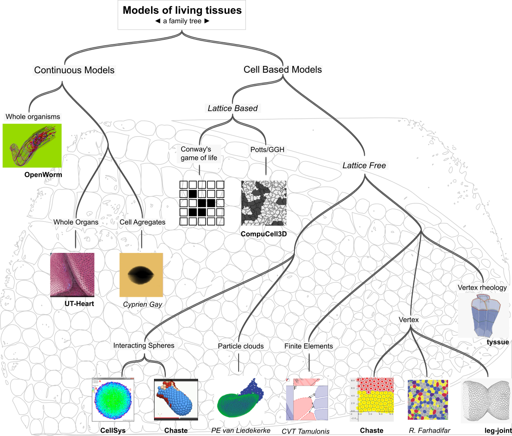

title: From leg-joint to tyssue, a refactoring story - Ep. 2
slug: gathering_thoughts
date:
tags: drosophila, modeling, python, scipy
summary: I'm giving a talk at Euroscipy '15 in two weeks \o/ \o/... This post is a place to gather thoughts on the `leg-joint` and `tyssue` libraries, of which I'll be talking - episode 2 of 3.

That's the second blog post of three reflecting on the modeling.

1. [Performance](gathering_thoughts.html) - read this first !
2. Future plans - the future is already here
3. Visualization - even more future !

## Previously

I started optimizing, then refactoring the `leg-joint` code to gain performance.
As I was doing this, I realized it would be cleverer to go all the way back to
the drawing board (actually a paper notebook), as maybe some parts of the
simulation could be re-used with different geometries. After all, many epithelia
share common traits with the leg imaginal disk. At the same time, Magali and I
started talking with two physicists, [François
Molino](http://www.coulomb.univ-montp2.fr/user/francois.molino) and  [Cyprien
Gay](http://www.msc.univ-paris-diderot.fr/~cgay/homepage/doku.php?id=Accueil),
who are applying bleeding edge soft-matter physics to biological tissues. It
turns out Cyprien and his colleges recently published a [milestone
paper](http://dx.doi.org/10.1140/epje/i2015-15033-4) on continuous models; both
were keen on trying cell based models, and the leg disk is of course very rich
on this regard. So while I'm generalizing geometry, why not physics?

So how do we get there?

1. Classify existing biophysical tissue models.

2. Specify the subset of said models we want to address.

3. Try to craft an API.

4. Choose the proper libraries.

5. Code simple test cases (simple geometry, simple physics).

6. Repeat from 3 until the API and tech are +/- stable...

7. Implement a real world problem, same physics as in 5.

8. Try new physics at constant geometry.

The route through those points will start a bit far from code.

### A very brief tour of the biophysical models of living tissues

As they imply dramatic changes in a tissue shape and organization, morphogenetic
events have long been the focus of mechanical modeling efforts. As early as
1917, D'Arcy Thomson exposed the underlying mathematical and physical
relationships underpinning cells and multi-cellular organism shapes and
dynamical behaviors (in the seminal work [On Growth and
Form](https://archive.org/details/ongrowthform00thom)). In recent years,
technical progresses have provided very detailed geometrical, dynamical and
biochemical data on morphogenetic processes, allowing for ever finer
mathematical modeling and computer simulations. Meanwhile, many models and
simulations have been developed. The interested reader will find a very clear,
useful and complete discussion of the topic in [C.V.T Tamulonis PhD
dissertation](http://dare.uva.nl/record/1/394902). Seriously, I can't stress
enough how this work is nice and complete!

For now, I just drafted a tree of the different models, as a basis for the
discussion:

The underlying dragonfly wing is from figure 162 of _On Growth and Form_ (p.476
of the above linked edition). On the last line are examples (not even close to
exhaustive) of implementation for each models. Bold names refer to softwares,
slanted to a researcher and it's publications.

**Continuous models** deal with phenomena that span multiple cells in size, such
that the changes in shape can be smoothed out, the detailed cell-cell
interactions are not necessary to understand the tissue's shape. Star among this
huge family are organ simulations, among which the heart. To grasp the state of
the art on the matter, [you should rush to see the
video](http://www.scls.riken.jp/en/research/03_integration/) of a heart
simulation by Shu Takagi's group at Riken. Cell agregates, such as
multi-cellular tumor spheroids, are studied and modeled as continuous tissues.
The paper cited above ([Sham Tilli et al,
2015](http://dx.doi.org/10.1140/epje/i2015-15033-4)) precisely sets down a
formalism that includes cell biology specific components (i.e. cell population
dynamics and re-arangements, more on that later) in a continuous dynamical
(rheological, more precisely) framework. See [Cyprien's
site](http://www.msc.univ-paris-diderot.fr/~cgay/homepage/doku.php?id=publications:2014granularcontractile)
for more details on that. Finally, I must mention the incredible [OpenWorm
project](http://www.artificialbrains.com/openworm), which tackles the
neurobiology of C. elegans and integrates it to a mechanical (particle based) framework.

For now let's concentrate on **Cell Based models**, in which `leg-joint` fits.

By definition cell based models are described by a multi-agent design pattern.
This is where biological tissues radically differ from any other material: cells
can **act by themselves** and **exchange information** between each others, an
individual's **behavior** influences the overall shape of the tissue. We'll see consequences of this for the API design. For now, let's go further down the tree.

The next branching is between lattice based and lattice free models.

_Lattice based_ were developed first, inheriting directly from early cybernetics
research (Norman Wiener, John Von Neumann) on [**cellular
automata**](https://en.wikipedia.org/wiki/Cellular_automaton). Conway's game of
life was described in 1970, and you can find a nice python implementation by
Jake VanderPlas himself
[here](https://jakevdp.github.io/blog/2013/08/07/conways-game-of-life/). It's
not a biological tissue model, really, but it captures the essence of lattice
based modeling: cells are pixels or collections of such on a fixed grid. The
evolution of the system is solved by looking at interactions between each pixel
and it's neighbors. That's what goes on in a more detailed manner in cellular
Potts models and their descendant the Glazier-Graner-Hogweg (GGH) model. These
models are well established, and [CompuCell3D](http://compucell3d.org) provides
a very handy, optimized and scriptable software for defining and running GGH
simulation in 2D and 3D geometries. Lattice based models are well suited to
study phenomena such as collective migration (e.g. tumor invasion) or cell
population dynamics. As partial differential equations can be solved across the
grid, they can also deal with reaction-diffusion mechanisms, and thus signaling.
That's all nice and well, but the grid is also a constrain (if precise shapes
are of interest), and the physics governing pixel state transition is very
phenomenological, it does not really capture the _mechanical_ aspects of the
tissue.

In _lattice free models_, the system's space (usually 2 or 3 dimensional)  is
continuous and the objects are described by their metric in that space. An early split is between
