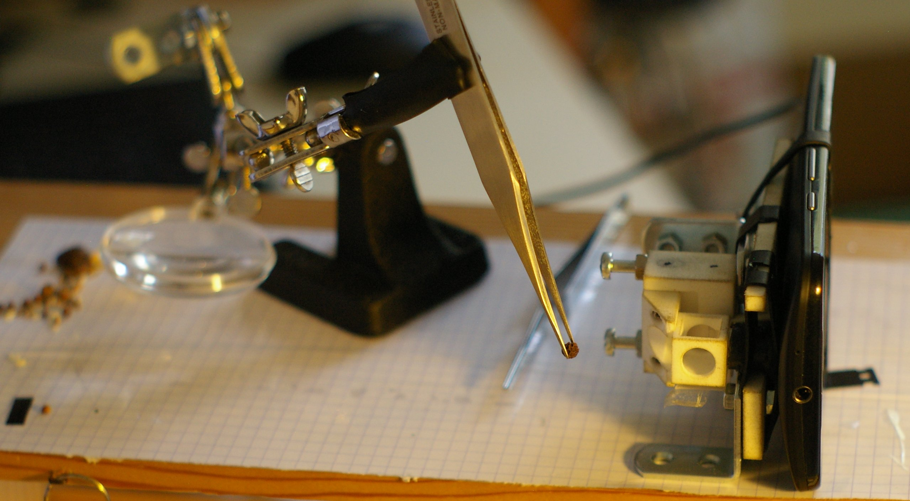

title: Mu spim, a ligth-sheet microscopy smartphone
slug: mu_spim_rubber
date:
tags: mu-spim, microscopy
summary: I'm happy to present the prototype of the mu-spim, a light-sheet microscope.

# La version 0.1 du mu-spim est sortie! mu-spim v0.1 is out!

Mu-spim implements **light sheet microscopy** on a
smartphone camera.

_Le Mu-spim est un microscope à **feuille de lumière** pour smartphone_

 

To take an image, one suspends the sample (here a grain of peper) in the small cubic room, in front of the telephone's objective.

_Pour prendre une image, on suspend l'échantillon (ici un grain de poivre) dans
la petite chambre cubique, devant l'objectif du téléphone_

The microscope uses the phone's LED flash to illuminate the sample, and a **cylindrical lens** creates a light-sheet. A section of the flat light field can be seen on the next image:

_Le microscope utilise la LED du téléphone pour illuminer un échantillon, et **une lentille cylindrique** créé une feuille de lumière. On voit ce champ lumineux par la tranche sur l'image suivante_

There is still a lot of work to have a proper instrument, but that nevertheless
the concrete output  of some months worth of head scratching. I don't have much
time for proper documentation,  [but you can browse the project on
github](https://github.com/glyg/mu-spim).

_Il y a encore beaucoup de travail pour avoir un instrument correct, mais c'est
quand même la concrétisation de quelques mois de remue-méninges. Je n'ai pas
beaucoup de temps pour écrire une documentation détaillée.  Les anglophones
peuvent se référer au site du projet (où on trouvera aussi des images)._

## Une graîne de cumin

## One video, fleur sêchée

<iframe src="https://player.vimeo.com/video/138321561" width="500" height="281" frameborder="0" webkitallowfullscreen mozallowfullscreen allowfullscreen></iframe> 
<a href="https://vimeo.com/138321561">Fleur s&ecirc;ch&eacute;e // Microscopy image of a flower stem. #mu-spim</a> from <a href="https://vimeo.com/user12210065">glyg</a> on <a href="https://vimeo.com">Vimeo</a>.

### À l'aide!!

Ce projet est encore au début de son développement, et à besoin de bras! Je
cherche des collaborateurs avec des compétences dans:

* L'_éducation, la vulgarisation, la divulgation_:

 Le but premier du mu-spim est de permettre la manipulation d'un microscope et
 l'observation de petits objets (vivants) par des jeunes publics et des scientifiques
 amateurs, en lien avec l'univers des fablabs et la recherche en biologie.

* La _communication scientifique_:

  Dans un deuxième temps, le projet mettra  en lien le public et les biologistes /
  microscopistes, à travers l'échange d'échantillons et d'images. C'est
  l'occasion de raconter un peu ce qu'il se passe dans les labos! Il y a en
  général sur le projet un gros boulot de rédactionnel (explication, notices de montage, etc.)

* La _production de projet / financement_:

  Eh oui, on ne vit pas seulement d'amour et d'eau fraîche. Ce projet mérite
  d'être supporté financièrement, si vous avez l'expérience de ce type de
  production (subventions / financement participatif...), faîtes signe!

* Le _dessin technique, la CAO_:

  Il y a encore beaucoup à faire sur ce plan là:
  améliorer les suppports d'optiques, dessiner le/les supports d'échantillons (motorisés!), faire une version facilement imprimable, etc.

* Le _design_:

  Voir la première photo de ce post, là aussi il y a du boulot!
  Il faut dessiner le carrénage, la boîte de transport, penser entièrement
  l'ergonomie de la collecte et du montage d'échantillon ...

* Le _développement mobile_:

  L'appli photo du téléphone n'est pas suffisante pour gérer finement
  l'aquisition d'image, une application dédiée sur le smartphone est
  indispensable!

* Le _traitement d'images et la vidéo_:

 Il y a du montage à faire, de la composition, la vidéo d'une campagne de
 financement participatif, etc. Il y a aussi des aspects web/backend qui peuvent
 être intéressants (site du projet, gallerie...)

* L'_analyse d'image et la reconstuction 3D_:

 Vaste programme, mais la microscopie à feuille de lumière est une méthode 3D,
 et l'un des objectifs du projet est là!

* La _microbiologie et la microscopie_ (last but not least):

  Je cherche des échantillons, des images, des sujets et des cas d'usage... Si
  vous êtes amenés à regarder des choses à la binoculaire, c'est intéressant
  pour le projet!

Le projet mu-spim est sous licence CC-BY-NA-NC. guillaume@damcb.com
